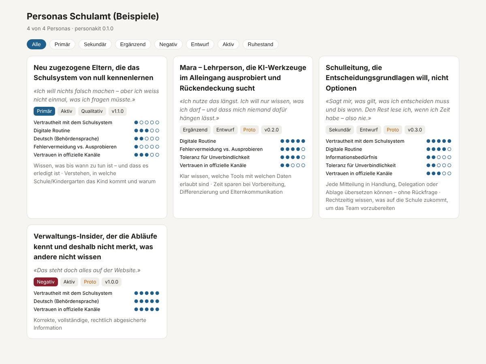

# personakit


> Evidence-based, behaviour-first personas as versioned Markdown files – with a Jobs-to-be-Done block, lint rules and a prompt export for use as a preset in AI solutions.

🇩🇪 [Deutsche Version](README.de.md)

## Overview

Many solutions – content generators, chat assistants, user-journey tools, prioritisation – need a persona as input. Usually it exists as a slide or a poster: not machine-readable, not versioned, not verifiable. personakit turns a persona into a **source file**: `<id>.persona.md` with a schema-validated YAML frontmatter and a Markdown body (scenario, narrative). Everything else – Markdown, card, JSON, YAML, prompt block, comparison matrix, HTML gallery, Notion pages – is rendered from it.

The format encodes method, not layout: behaviour before demographics (Cooper), goals as experience/end/life goals, jobs as job stories with forces of progress, an explicit evidence level, a lifecycle with review dates, and guardrails against the variance collapse of synthetic users. Background and design decisions: [`docs/METHOD.md`](docs/METHOD.md) (German). Field reference and lint codes: [`docs/FORMAT.md`](docs/FORMAT.md) (German).

## Features

- One file per persona: YAML frontmatter + Markdown body, validated against a JSON Schema
- Behaviour variables as 1–5 scales with anchors; demographic facts only with a stated relevance (Chekhov's gun)
- Jobs-to-be-Done block: job stories, push/pull/anxiety/habit, ODI outcome statements, importance and satisfaction → opportunity score
- Visible evidence level (`proto` · `qualitative` · `statistical`) with sources, assumptions and open questions
- Lifecycle: SemVer, status, review date, changelog – maintained by `bump` and `retire` with clean git diffs
- `simulation` block (voice, must, must_not, variance) injected into the prompt export in `simulate` or `audience` mode
- Exports: Markdown, card, JSON, YAML, prompt block, comparison matrix, single-file HTML gallery, JSON bundle, Notion pages (API or MCP)
- 45 lint rules for method (evidence hygiene, JTBD form, guardrails, lifecycle, one primary persona per set, references to [journeykit](https://github.com/malkreide/journeykit) journeys)
- Sets per solution (`personas/<set>/set.yml`): the same persona can play a different role – with a different priority – in several solutions; lint rules for focus run per set
- Factoid pipeline: research material as `factoids/<study>/*.factoids.md` (participant codes only, never names); `factoids` places participants on the behaviour variables and flags thin variables and outliers, `skeleton` pre-fills a persona from chosen participants (medians, evidence, quotes, evidence level)
- Collapse probe: `probe build` turns the personas of a set into test questions for a model of your choice, `probe evaluate` measures whether the simulated personas stay distinguishable (traffic light per pair, `must_not` and unknowns check) – and says what lexical similarity cannot show
- Claude skill `persona-kit` that derives personas from interviews, support logs and workshop notes – counting via `factoids`/`skeleton`, interpretation backed by factoid IDs

### Demo



## Prerequisites

- Python 3.10+
- `ruamel.yaml`, `jsonschema` (installed automatically)

## Installation

```bash
git clone https://github.com/malkreide/personakit
cd personakit
pip install -e ".[dev]"
personakit --version
```

## Usage / Quickstart

```bash
# scaffold a persona (template with commented fields)
personakit new parents-new-in-town -a "Newly arrived parents learning the school system from scratch"

# check: schema + method rules
personakit lint personas

# overview and comparison
personakit list personas
personakit render personas -f matrix

# export
personakit render personas/elternkommunikation-schuleintritt/eltern-neu-in-zuerich.persona.md -f md
personakit render personas/elternkommunikation-schuleintritt/eltern-neu-in-zuerich.persona.md -f prompt -m audience   # target-audience preset
personakit render personas/elternkommunikation-schuleintritt/eltern-neu-in-zuerich.persona.md -f prompt -m simulate   # synthetic counter-check
personakit render personas -f html -o personas.html
personakit render personas -f bundle -o personas.json
personakit render personas -f notion -o notion.json   # pages for a Notion database «Personas»

# maintain
personakit bump personas/elternkommunikation-schuleintritt/eltern-neu-in-zuerich.persona.md -p minor -m "added J3" --review-days 180
personakit retire personas/old-persona.persona.md -m "replaced after new interviews"

# from research material to a skeleton
personakit factoids factoids/beispiel
personakit skeleton factoids/beispiel -p p1,p3,p4,p6,p8 --id parents-draft -a "Newly arrived parents learning the school system from scratch"

# collapse probe: do simulated personas stay distinguishable?
personakit probe build personas/elternkommunikation-schuleintritt -o probe.json --answers-template answers.json --keywords-template probe-keywords.yml
#   … run the plan against a model of your choice, fill answers.json …
personakit probe evaluate probe.json answers.json -k probe-keywords.yml -o probe-report.md
```

The example personas in [`personas/`](personas/) are **synthetic** (German, school-administration context) and do not document any real research.

### Sets per solution

A set groups the personas of one solution: `personas/<set-id>/set.yml` with `id`, `title`, `solution`, `scope`, `status` and `personas: [{id, priority}]`. Membership is declared only there, so one persona file can be listed by several sets, each with its own priority; the `priority` in the persona file is the default. Personas that no set lists form a loose set, so a repository without `set.yml` works as before. The examples show both: `elternkommunikation-schuleintritt` and `ki-leitplanken-lehrpersonen` share `schulleitung-entscheidungsorientiert` and `verwaltungs-insider`, and `lehrperson-ki-explorierend` is primary only in the second set. Details: [`docs/FORMAT.md`](docs/FORMAT.md#sets-setyml).

### From research material to a persona

The counting is a tool, the interpretation is not. A study folder `factoids/<study>/` holds one `<source_id>.factoids.md` per source – frontmatter (`source_id`, `type`, `date`, `n`, `consent_note`) and one table row per factoid (`id`, `participant`, `observation`, `variable`, `value`, `quote`) – plus an optional `variables.yml` with the scales and their anchors. `personakit factoids` places every participant on every variable and flags thin variables and participants that sit ≥ 2 points apart from everyone else on at least two variables. `personakit skeleton` turns the participants you choose into a draft persona; which participants form a persona, and its archetype, goals, jobs and simulation rules, stay with the person or the `persona-kit` skill, backed by factoid IDs. Participants appear as codes only; real study folders are excluded by `.gitignore`, only the synthetic [`factoids/beispiel/`](factoids/beispiel/) is versioned. Details: [`docs/FORMAT.md`](docs/FORMAT.md#factoids-factoidsmd).

## Available Commands

| Command | Description |
|---|---|
| `new <id> -a …` | Create a persona file from the commented template; the archetype is required (asked for interactively if missing) |
| `validate <paths>` | Validate the frontmatter against the JSON Schema |
| `lint <paths>` | Schema plus 45 method rules; exit code 1 on errors (`--strict` also on warnings), `--json` for CI and other tools, `--journeys <path>` checks references to journeykit journeys in both directions |
| `render <paths> -f …` | `md`, `card`, `json`, `yaml`, `prompt` (per persona) or `matrix`, `html`, `bundle`, `notion` (grouped by set; `notion --target api\|mcp`) |
| `list <paths>` | Overview table per set (priority in the set, status, evidence, version, review date) |
| `bump <file>` | Raise the version, write a changelog entry, optionally change status, evidence level and review date |
| `retire <file>` | Set status to `retired` with a changelog note |
| `factoids <folder>` | Check a study folder of `*.factoids.md`: participant × variable matrix, distribution, thin variables (F010), outliers (F011); `--json` |
| `skeleton <folder> -p … --id … -a …` | Persona skeleton from chosen participants: behaviour variables (medians), evidence, quotes, evidence level and a `## Herleitung` section with factoid IDs |
| `probe build <paths>` | Collapse probe plan: the simulate prompt and 6–10 test questions per persona (scenario, jobs, pains, unknowns, end goals), every question asked to every persona; deterministic, no model call; templates for answers and keywords |
| `probe evaluate <plan> <answers>` | Markdown report with a traffic light per persona pair (TF-IDF cosine of the answers to the same question, standard library only), the form of the answers per persona (length, structure, opening word – flags a form collapse the traffic light cannot see), `must_not` check via configurable keywords with quoted, negated or asked mentions kept apart from uses, unknowns left open or not, limits of the method; `--json`, `--strict` |

## Persona as input for other solutions

| Use | Export |
|---|---|
| Content for a target audience (letters, web copy, FAQ) | `render -f prompt -m audience` |
| Test a draft against a persona, rehearse an interview | `render -f prompt -m simulate` |
| User journeys ([journeykit](https://github.com/malkreide/journeykit)) | `render -f json` / `-f bundle`; the journey's `persona.id` is the persona `id`, `lint --journeys` checks both directions ([`docs/JOURNEYKIT.md`](docs/JOURNEYKIT.md), German) |
| Prioritisation | `render -f matrix` (ODI opportunity score) |
| Notion database «Personas» | `render -f notion`: one page per persona, `ID` as the key for updates; `--target api` for the Notion API, `--target mcp` for the Notion MCP tools ([`docs/FORMAT.md`](docs/FORMAT.md#notion-export-render--f-notion), German) |
| Wiki | `render -f md` / `-f card` |
| Team gallery, offline | `render -f html` |
| Check whether simulated personas stay distinguishable | `probe build` → model of your choice → `probe evaluate` ([`docs/PROBE.md`](docs/PROBE.md)) |

The prompt export carries the persona's guardrails: one concrete individual instead of an average, no invented facts, open questions stay open, proto status is marked as a hypothesis.

### As a library

Tools that embed personakit (such as an MCP server) use `personakit.api` instead of the CLI:

```python
from personakit.api import load_workspace_tolerant, lint_workspace

ws = load_workspace_tolerant(["personas"])   # valid personas, sets, groups; broken files in ws.problems
report = lint_workspace(["personas"])        # exactly what `personakit lint personas` checks
```

`load_workspace_tolerant` keeps going when a file is unreadable, violates the schema or a `set.yml` is broken, and reports it with the lint codes `P000`, `SCHEMA` or `X000`. The CLI commands stay strict.

## Configuration

No configuration files beyond the optional `set.yml` per set and `variables.yml` per factoid study. The schemas live in `src/personakit/schema/` (`persona.schema.json`, `set.schema.json`, `factoids.schema.json`, `variables.schema.json`, plus `probe*.schema.json` for the collapse probe's plan, answers and keywords), the template in `src/personakit/templates/persona.template.md`.

## Project Structure

```
personakit/
├── src/personakit/
│   ├── cli.py            # argparse CLI
│   ├── api.py            # library entry points: tolerant loading, lint_workspace
│   ├── model.py          # frontmatter round-trip (ruamel.yaml), sections
│   ├── validate.py       # JSON-Schema validation
│   ├── sets.py           # set.yml, per-set priority, loose set
│   ├── factoids.py       # *.factoids.md, participant matrix, persona skeleton
│   ├── lint.py           # method rules
│   ├── journeys.py       # cross-lint against journeykit journeys (K000–K004)
│   ├── render.py         # md, card, json, yaml, prompt, matrix, html, bundle
│   ├── notion.py         # Notion export: API blocks and Notion Markdown (no network calls)
│   ├── probe.py          # collapse probe: test questions, TF-IDF similarity per pair, report
│   ├── schema/           # persona, set, factoids, variables, probe (JSON Schema)
│   └── templates/        # persona.template.md
├── personas/             # four synthetic example personas in two sets (set.yml)
├── factoids/beispiel/    # synthetic example study (real study folders are git-ignored)
├── skills/persona-kit/   # Claude skill + elicitation guide
├── docs/                 # METHOD.md, FORMAT.md, JOURNEYKIT.md, PROBE.md, demo.png
├── scripts/              # validate_repo.py (repo structure check)
└── tests/
```

## Changelog

See [CHANGELOG.md](CHANGELOG.md)

## Contributing

Contributions are welcome — see [CONTRIBUTING.md](CONTRIBUTING.md).

## Security

Please report vulnerabilities as described in [SECURITY.md](SECURITY.md).

## License

MIT License — see [LICENSE](LICENSE)

## Author

Hayal Özkan · [malkreide](https://github.com/malkreide)
